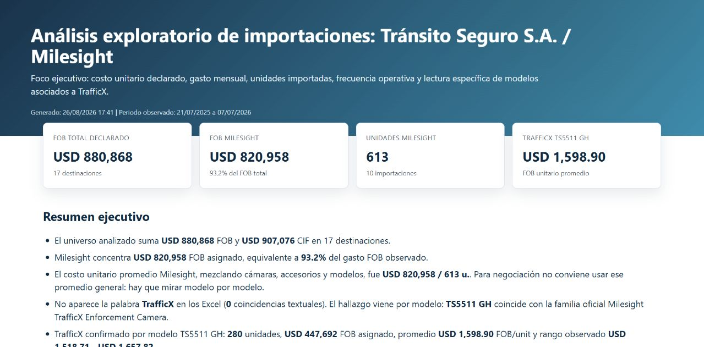
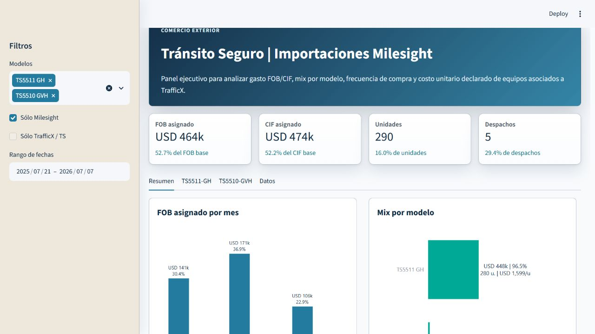

# Comex + Data Analytics

## Análisis de importaciones para decisiones de sourcing

Este proyecto convierte registros aduaneros argentinos en información accionable para Comercio Exterior: cuánto se importó, qué modelos concentraron el gasto, cómo evolucionó el costo unitario y qué señales sirven para preparar una negociación con proveedores.

Es un caso práctico de cómo combinar conocimiento de importaciones, normalización de datos y visualización ejecutiva para pasar de una planilla operativa a una lectura comercial clara.





## Qué demuestra

- Lectura de registros detallados de importación y normalización de campos aduaneros.
- Análisis de FOB, CIF, unidades, despachos, modelos, NCM e Incoterms.
- Identificación de familias de producto a partir de marca, descripción y modelo.
- Asignación analítica de FOB/CIF cuando un despacho agrupa varios submodelos.
- Cálculo de mix, frecuencia de compra, evolución mensual y costo unitario.
- Presentación ejecutiva en HTML interactivo y exploración con Streamlit.
- Traducción de datos de Comercio Exterior a preguntas concretas de sourcing y negociación.

## El problema de negocio

Los registros aduaneros suelen venir fragmentados: un mismo despacho puede incluir varios modelos y el valor declarado puede aparecer concentrado en una sola línea. El pipeline reconstruye una vista analítica consistente para responder:

- ¿Qué modelos explican la mayor parte del FOB importado?
- ¿Cuál es el costo unitario observado por modelo?
- ¿Cada cuánto se repiten las compras?
- ¿Qué productos conviene priorizar al pedir una nueva cotización FOB?
- ¿Qué datos sirven para comparar una oferta de Alibaba contra el historial observado?

## Muestras visuales

### Reporte HTML

Reporte ejecutivo standalone con KPIs y gráficos interactivos para presentar los principales hallazgos.

### Dashboard Streamlit

Panel filtrable por modelo y fecha, con vistas específicas para TS5511-GH y TS5510-GVH, tarjetas ejecutivas, gráficos y detalle de compras.

## Stack

- Python
- pandas y NumPy para transformación y análisis.
- Plotly para visualizaciones interactivas.
- Matplotlib y Seaborn para gráficos de respaldo.
- Streamlit para exploración interactiva.
- Jinja2 para generar el reporte HTML y Markdown.
- `zipfile` y `xml.etree` para leer `.xlsx` sin depender exclusivamente de Excel.

## Cómo reproducirlo

Los archivos de comercio exterior no están incluidos en este repositorio público. Para ejecutar el análisis se necesita contar localmente con archivos que sigan este patrón:

```text
detalle_ARimportDetalladas_*.xlsx
```

Luego:

```powershell
python -m venv .venv
.venv\Scripts\Activate.ps1
pip install -r requirements.txt
python src\analisis_importaciones.py
python -m streamlit run streamlit_app.py
```

La app queda disponible en `http://localhost:8501`.

## Pipeline analítico

1. Leer y combinar los Excel de detalle.
2. Normalizar encabezados, fechas, cantidades y valores declarados.
3. Identificar marcas, familias y modelos relevantes.
4. Asignar FOB/CIF por submodelo cuando el despacho agrupa varias líneas.
5. Calcular métricas por modelo, mes y despacho.
6. Generar visualizaciones y el dashboard interactivo.

La asignación por submodelo es una herramienta analítica: ayuda a estudiar mix y costo observado, pero no reemplaza la factura comercial ni una apertura real de precio por SKU.

## Privacidad y alcance

Los Excel fuente, datos procesados y reportes generados quedan excluidos del repositorio porque pueden contener valores, volúmenes, modelos y referencias comerciales sensibles. Las imágenes del README son muestras visuales preparadas para portfolio y no reemplazan el dataset original.

## Estructura

```text
src/analisis_importaciones.py   Pipeline reproducible
streamlit_app.py                Dashboard interactivo
docs/                           Capturas para portfolio
requirements.txt                Dependencias Python
design-system/                  Criterios visuales del dashboard
```

## Perfil del proyecto

Proyecto desarrollado desde la perspectiva de Comercio Exterior y sourcing internacional: usar datos históricos de importación para mejorar la lectura de mercado, preparar negociaciones y tomar decisiones de compra con mayor evidencia.
